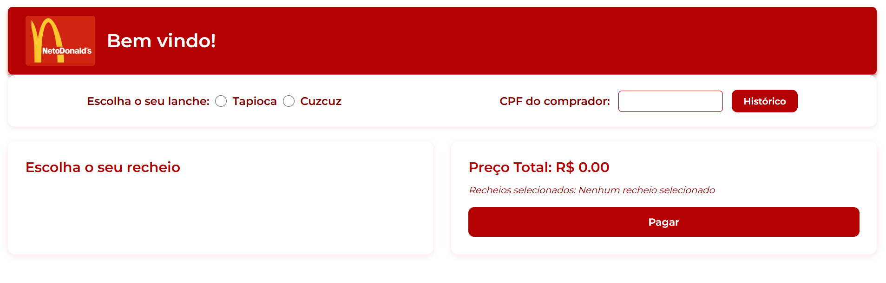

# Projeto Netodonalds

O objetivo do projeto é simular a compra de alimentos típicos, como tapioca e cuscuz, onde o usuário pode escolher recheios, informar seu CPF e realizar o pagamento. As informações são registradas e podem ser consultadas posteriormente por histórico.

## Design do projeto

  

## Funcionalidades

- [x] Escolha entre Tapioca ou Cuscuz
- [x] Seleção de recheios adicionais
- [x] Cálculo dinâmico do preço total
- [x] Pagamento com CPF obrigatório
- [x] Histórico de compras por CPF
- [x] Interface estilizada com tons de vermelho e branco
- [x] Modais estilizados com SweetAlert2
- [x] Layout responsivo e interativo

### Observações

> [!NOTE]  
> Projeto desenvolvido como simulação de compras utilizando tecnologias web (HTML, CSS, JS, Node.js e PostgreSQL).

> [!IMPORTANT]  
> Para que o pagamento funcione, o usuário deve selecionar uma comida e informar o CPF.

## Contatos

Email: rocha.coelho60@aluno.ifce.edu.br